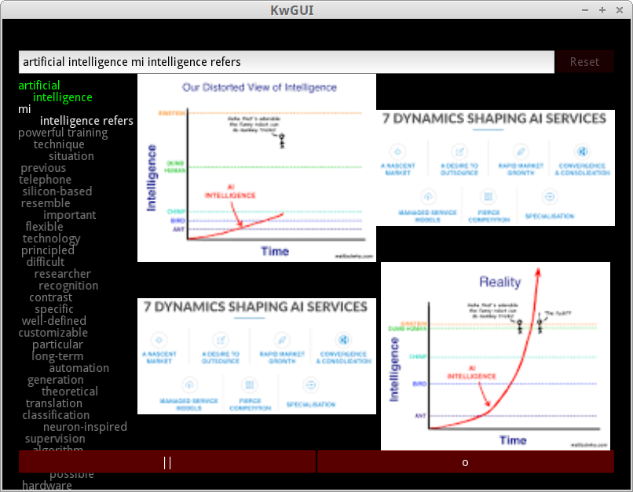

# keyword-search
Find (possibly unknown) keywords associated to other (known) keywords. Starting from user-defined seed keywords the program finds associated ones from google results. Texts from related google images searches are also considered. The process is repeated until reaching one stop criteria (i.e., the user stops the program or the extracted keywords don't change much anymore). 

# Gui

The user can interact with the iterative search through a gui (it is also possible to interact with the program programmaticaly). To open the gui open a terminal from the program's directory and type:

python kwGui.py

- To start a keyword search type search term and press enter or click on the "search" button.

- Keywords will be shown on the left and related images on the right side of the gui.

- Keyword types:
	- Top (green): original ("permanent") keywords included in all the iterations.
	- Middle (white): relevant keywords included as search terms, but they are not permanent and can be demoted in subsequent iterations.
	- Bottom (gray): the remaining keywords sorted by their relevance.

- Keywords can be promoted or demoted by moving them up or down into a different keyword region, respectively.

- Keywords can be "erased" making them a negative keyword in subsequent searches. Erase a keyword by draggin it to the side until the picture of a trashcan appears.

- Clicking on an image opens its respective website on a browser. While the user checks the website the program will be paused. To resume the user is given the choice to state whether or not the information in the website was relevant.

- To manually pause or stop a search press the "||" or "o" buttons, respectively.

- The search terms could be reset by erasing terms and/or typing new ones and pressing "Reset".

# Todo
- The web scrapping abilities of the program might require an update (i.e., update GoogleImagesSearch in SearchUtils.py). Many thumbnails do not load at the moment.

- Store the thumbnails so that only gathered images are (quickly) displayed.
	- The gui could pick an image from the folder with a weight proportional to the logarithm of the thumbnail number. This way the latest-adquired thumbnails will be favored (but not overwhelmingly so).

- Might be nice to more clearly separate the program core from the GUI by putting the GUI on a separate folder and making it gather information from the "ipc" folder.

- The "database", currently a json file, should probably be switched to an actual database to make it easy to handle reads and writes.
